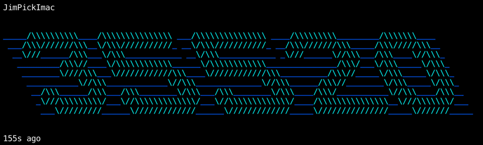

filecoin-big-head
=================

A simple command line tool to display the height of the
Filecoin blockchain that your node has synced.

# Install

```
npm install -g filecoin-big-head
```

Or just try it out without installing:

```
npx filecoin-big-head
```

# Examples

```
npx filecoin-big-head
```


```
npx filecoin-big-head --font=3d --color=cyanBright,blue --flash-color=whiteBright
```



# License

MIT

